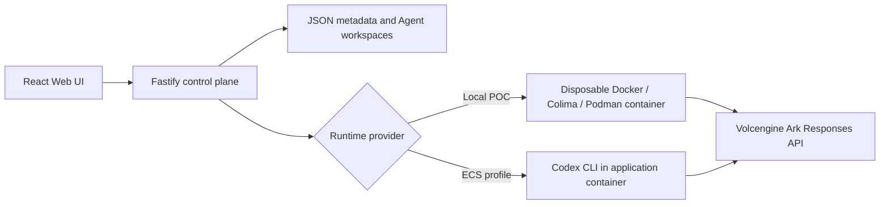

# Volc Agent Launchpad

A minimal Agent platform for three-day middleware hackathons. It provides Agent
CRUD, a browser Playground, persistent workspaces, and Codex CLI backed by the
Volcengine Ark Responses API.

Run it locally with Docker, Colima, or rootless Podman, or deploy it to
Volcengine ECS.

> [!WARNING]
> This is a single-user proof of concept. It intentionally has no identity,
> tracing, audit, or hardened sandbox middleware. Do not use production data or
> credentials. See [SECURITY.md](SECURITY.md).

## Screenshots

### Agent Playground


### Create an Agent


## Features

- React and TypeScript Web UI
- Agent create, edit, start, stop, delete, and multi-turn chat
- Fastify control plane with asynchronous Run state
- Persistent Agent workspaces and Codex sessions
- Disposable Docker, Colima, or Podman container for each local turn
- Docker and Terraform deployment paths for Volcengine ECS

## Requirements

- Node.js 22+
- npm 10+
- Docker, Colima, or Podman
- A Volcengine Ark API key and endpoint that supports the Responses API

Codex CLI is included in the Runtime image and is not required on the host.

## Local browser SOP

### 1. Check the local tools

Install Node.js 22+ and one supported container engine, then verify them:

```bash
node --version
npm --version
docker --version        # Docker Desktop, Docker Engine, or Colima
podman --version        # Use this instead when running Podman
```

Only one container engine is required. Codex CLI is already included in the
Runtime image.

### 2. Clone the repository

```bash
git clone <repository-url> volc-agent-launchpad
cd volc-agent-launchpad
```

Skip this step when already working from the repository root.

### 3. Start the POC

```bash
ARK_API_KEY=your-ark-api-key \
ARK_MODEL=ep-your-endpoint-id \
npm run poc
```

The first run installs Node.js dependencies and builds the Runtime image. The
script automatically selects Docker, Colima, or Podman.

### 4. Open the browser

Visit <http://localhost:3000>, or open it from the terminal:

```bash
open http://localhost:3000       # macOS
xdg-open http://localhost:3000   # Linux desktop
```

In the Web UI:

1. Select **Create Agent**.
2. Enter a name, description, instructions, and optionally choose or name a workspace.
3. Select **Create Agent** again.
4. Enter a task in the Playground, for example:

   ```text
   Create a TypeScript hello-world CLI, add a test, and run it.
   ```

The Agent can write files, run commands, and continue the same Codex session in
later messages.

### 5. Stop and resume

Press `Ctrl+C` in the startup terminal. The script removes temporary Runtime
containers but keeps Agent workspaces and conversations.

- macOS state: `~/.volc-agent-launchpad/`
- Linux state: `.local/`
- Custom location: set `LOCAL_POC_DATA_ROOT`

Run the same `npm run poc` command to continue later.

### Select a specific container engine

Force Podman when multiple engines are installed:

```bash
CONTAINER_ENGINE=podman \
ARK_API_KEY=your-ark-api-key \
ARK_MODEL=ep-your-endpoint-id \
npm run poc
```

Colima uses `CONTAINER_ENGINE=docker` because it exposes the Docker CLI.

For a clean Linux host, follow the
[rootless Podman setup](docs/LOCAL_POC.md#rootless-podman-on-linux).

## Docker Compose

Create and edit the configuration:

```bash
./scripts/bootstrap-local.sh
```

Required values in `.env`:

```dotenv
ARK_API_KEY=your-ark-api-key
ARK_MODEL=ep-your-endpoint-id
APP_AUTH_TOKEN=replace-with-at-least-24-random-characters
```

Start the application:

```bash
docker compose up --build
```

Open <http://localhost:3000>. Stop it without deleting Agent data:

```bash
docker compose down
```

## Development

```bash
npm install
cp .env.example .env
npm install --global @openai/codex@0.111.0
npm run dev
```

- Web UI: <http://localhost:5173>
- API: <http://localhost:3000>

Use local paths in `.env` when running outside Docker:

```dotenv
APP_DATA_DIR=.data
AGENT_WORKSPACE_ROOT=workspaces
CODEX_HOME=codex-home
```

## Deployment

- [Existing Linux ECS with Docker](docs/DEPLOYMENT.md#existing-linux-ecs)
- [Complete Volcengine environment with Terraform](docs/DEPLOYMENT.md#terraform-deployment)
- [Local Docker, Colima, and Podman details](docs/LOCAL_POC.md)

The existing-ECS script deploys from the current source tree:

```bash
cp .env.example .env.production
./scripts/deploy-existing-ecs.sh .env.production
```

The Terraform path provisions VPC, subnet, security group, ECS, and EIP:

```bash
cp deploy/volcengine/terraform.tfvars.example \
  deploy/volcengine/terraform.tfvars
./scripts/deploy-volcengine.sh
```

## Configuration

| Variable | Default | Purpose |
| --- | --- | --- |
| `ARK_API_KEY` | Required | Ark model API key. |
| `ARK_MODEL` | Required | Responses-capable endpoint or model ID. |
| `ARK_BASE_URL` | BytePlus ap-southeast v3 | Ark OpenAI-compatible API URL (TechJam uses BytePlus ModelArk). |
| `OPENAI_API_KEY` | Required for `openai` | OpenAI API key, passed to Codex CLI as an env var. |
| `OPENAI_MODEL` | Codex default | Optional model override for the `openai` provider. |
| `APP_AUTH_TOKEN` | Empty (auth off) | Bearer token for every `/api/*` route. Empty disables auth entirely; the demo sets 24+ random characters so "protects API routes" is real, and production refuses to listen beyond loopback with fewer. |
| `RUNTIME_PROVIDER` | `local-process` | `container` for disposable local Runtime containers. |
| `CODEX_SANDBOX_MODE` | `workspace-write` | Codex inner sandbox mode. |
| `CODEX_TIMEOUT_MS` | `600000` | Maximum duration of one turn. |
| `LOCAL_POC_DATA_ROOT` | Platform-specific | Local metadata, workspace, and session directory. |
| `GLASSBOX_CAPTURE_POLICY` | `metadata_only` | `metadata_only` or `safe_summary`; raw capture is not implemented. |
| `GLASSBOX_DEMO_FAILURE` | `off` | `timeout` forces a 3 s runtime timeout for the demo's controlled failure. |
| `GLASSBOX_TRACE_DIR` | `$APP_DATA_DIR/traces` | Directory for per-Run NDJSON trace files. |
| `GLASSBOX_RETENTION_DAYS` | `7` | At startup, compact finished Runs whose last event is older than this to terminal events + a `trace.truncated` tombstone. `0` disables. |
| `GLASSBOX_MAX_DISK_MB` | `200` | At startup, while trace files exceed this, compact the oldest finished Runs first (running Runs are never touched). `0` disables. |

See [.env.example](.env.example) for all Runtime and resource-limit options.

## How it works



The first turn uses `codex exec`; later turns resume the stored Codex thread.
Deleting an Agent archives its workspace under `workspaces/.deleted/`.
Named workspaces may be shared by multiple Agents and are never archived by Agent deletion. To seed one before creating an Agent, create a directly nested directory such as `workspaces/repo-doctor`; the Create Agent workspace field will list it after startup. Switching an Agent's workspace clears its Codex thread so later turns cannot retain references to the previous project.

See [docs/ARCHITECTURE.md](docs/ARCHITECTURE.md) for component and extension
boundaries.

## Validation

```bash
npm run check
terraform fmt -check -recursive deploy/volcengine
docker compose config
```

### Demo steps (PRD §13)

Before you start: `.env` sets `APP_AUTH_TOKEN` to 24+ random characters (empty disables auth, and the
"bearer token protects `/api/*`" beat would be a lie) and `GLASSBOX_DEMO_FAILURE=off`. The server reads
both once at boot, so every change below needs a restart. `npm run dev` and Compose read `.env`;
`npm run poc` reads the shell environment (`set -a; . ./.env; set +a` first).

1. Start the server, then seed one ok Run: `bash scripts/seed-demo.sh ok` (creates the **Demo** Agent
   if missing, sends one real task, waits, prints the run id — never the token).
2. Set `GLASSBOX_DEMO_FAILURE=timeout` → restart the server → `bash scripts/seed-demo.sh fail` (the
   second Run times out after 3 s through the real Run path) → open its trace in the browser and check
   the banner → set `GLASSBOX_DEMO_FAILURE=off` → restart the server.
3. Rehearse: open <http://localhost:3000>, unlock with the token → select **Demo** → send a real task →
   the Runs list opens on **Needs attention** with the timeout Run on top → click it (the Playground
   collapses; **Close trace** restores it) → **Jump to failing span** → trust badges → architecture.

### Controlled failure (demo)

The sequence is explicit and needs two restarts: set `GLASSBOX_DEMO_FAILURE=timeout` → restart the
server → run a task → open its trace → set it back to `off` → restart. The fixture adds no failure path
of its own: it only overrides `CODEX_TIMEOUT_MS` to 3 s for the next Run, which then takes the ordinary real
runner timeout — SIGTERM→SIGKILL for `local-process`, `docker rm --force` for `container` — and ends in
a `run.timed_out` terminal event. Open `GET /api/runs/<runId>/trace`: `summary.failure.diagnosis` names
the failing span. Unset the variable to return to normal. The fixture is off by default and never
enabled by `npm run poc`.

What the automated suite proves and what it does not: the tests drive `AgentService` through a fake
runner, so they cover the classification (timeout status, terminal event, first-failure focus,
determinism across two Runs) but not the real process/container teardown. The real-runner span shape
and its cleanup evidence (`runtime.codex.failed` with `terminationSignal`, `runtime.container.stopped`
with `cleanup: "rm --force" | "signal"`) are covered by the E2E lane below, not by the unit suite.

### Verification (E2E lane)

`npm run test:e2e` (`scripts/e2e/run.sh`, bash) runs the judged configuration end to end: it goes through
`scripts/start-local-poc.sh` (Docker runtime image, `NODE_ENV=production`, `RUNTIME_PROVIDER=container`,
`ARK_*` from `.env` or `E2E_ENV_FILE`) with a throwaway state root under the temp dir, `PORT=${E2E_PORT:-3100}`
and its own `RUNTIME_INSTANCE_ID`, so a live `npm run poc` on :3000 is never touched. The driver
(`scripts/e2e/driver.cjs`, Playwright against installed Chrome) creates an Agent, runs a real model task, opens
the trace from the Runs table by keyboard, walks the span tree, the drawer and its focus trap, applies the
filters, checks export headers and byte-equality with `/trace`, restarts the server with
`GLASSBOX_DEMO_FAILURE=timeout`, verifies the gated failure (first failing step `codex exec`, capabilities
`unknown`, `cleanup: "rm --force"`, no `launchpad-*` container left), then sweeps seeded fake Ark/OpenAI/bearer/
private-key strings (planted in the prompt and the Agent instructions) across every NDJSON file, `/api/runs`,
`/trace`, `/events`, `/export`, the server log and the rendered GlassBox DOM, and prints append/query p95
(bounds 200 ms / 500 ms). Playwright is deliberately not a dependency: run `npx -y playwright@1.60.0 --version`
once and point `PLAYWRIGHT_DIR` at the npx cache directory it created (or set `NODE_PATH`). Expect 2–4 minutes;
state is kept on failure and its path printed. Two manual steps complete the regression: run
`npm run check` from a clean clone (`git clone … && npm ci && npm run check`) and the starter-kit acceptance
flow (`baseline-verifier` agent). On Windows the single allowed `npm run check` failure is the `/tmp` path
assertion in `container-codex-runner.test.ts` (see the Windows caveat in `CLAUDE.md`).

## Limitations

- Agents run in disposable containers and cannot expose ports to the user's machine; runnable build output stays in the workspace with a host-side command to start it.
- Single process. `JsonStore` and the NDJSON trace store are in-memory-plus-file with no cross-process locking; run one server.
- Local NDJSON trace store only — no external backend, no query engine beyond the in-memory index. Retention is a startup-only pass (`GLASSBOX_RETENTION_DAYS` / `GLASSBOX_MAX_DISK_MB`); evicted Runs keep their metadata skeleton and a `trace.truncated` tombstone.
- No `workspace.changed` events on this Codex/Ark stack: Ark shells out instead of calling `apply_patch`, so no `file_change` item has ever been observed (see [docs/CODEX_EVENTS.md](docs/CODEX_EVENTS.md)). The mapping exists but stays dormant rather than inventing a diff.
- Redaction is a key denylist plus a bounded pattern scan. It is exact on structured attributes and best-effort on free text; a novel secret format in a command string can slip past, which is why the default capture policy is `metadata_only`.
- Model/tool capabilities have exactly three states and are never guessed: `observed` (the runtime emitted events for that layer), `unavailable` (the Run completed and the runtime exposed no tool or model detail — not "the runtime has no tools"; this is the only case that emits `capability.unavailable`), and `unknown` (the Run was cancelled, timed out, or its stream never started — including error Runs that died before the first stream event — so nothing was said and its absence proves nothing; the trace header shows "no evidence — run cut short").
- The unit suite never runs the built server; the production-mode routes and the real Docker teardown are only proven by the [E2E lane](#verification-e2e-lane), which needs Docker, Chrome and an Ark key.

## Documentation

- [Project brief](docs/PROJECT_BRIEF.md) — concept, what is built, sprint plan, working agreements
- [Sprint plan](docs/SPRINTS.md)
- [UAT coverage](docs/UAT_COVERAGE.md) — what has been tested, how, and what remains
- [Architecture](docs/ARCHITECTURE.md)
- [Local POC](docs/LOCAL_POC.md)
- [Deployment](docs/DEPLOYMENT.md)
- [Hackathon extension guide](docs/HACKATHON_EXTENSION_GUIDE.md)
- [Security policy](SECURITY.md)
- [Contributing](CONTRIBUTING.md)

## License

[MIT](LICENSE)
