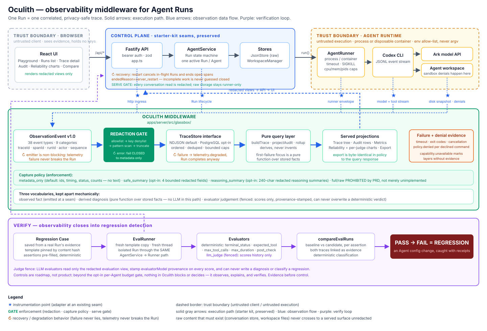

# Oculith

**TikTok TechJam 2026 · Track 1 "Agent Launchpad" · selected middleware track: Glass Box (observability).**
Built on the CodeJam Starter Kit (React Playground + Fastify control plane + Codex CLI on the
Volcengine/BytePlus Ark Responses API); Oculith is the middleware layer this team added on top.

## Problem statement (Track 1)

A Run on the starter kit is a black box: the Playground shows a final message or a one-line error, but
nothing connects the HTTP request, service state transitions, the runner process/container, Codex's own
event stream, and the terminal result. When something fails, an operator cannot tell **which layer**
failed — and the naive fix (dump everything to a log) turns observability into a secret-leak liability.
Track 1 leaves "trace timeline" and "audit model" as intentionally absent middleware; Oculith fills
that gap. Full statement: [docs/PROBLEM_STATEMENT.md](docs/PROBLEM_STATEMENT.md) · spec: [docs/PRD.md](docs/PRD.md).

## Product thesis: instrument → observe → audit → verify

Ship **evidence before control**. Every Run becomes one correlated, privacy-safe trace; everything else
is derived from those stored facts and never invented:

| Plane | What it gives you |
|---|---|
| **Instrument** | The real seams (Fastify → `AgentService` → `AgentRunner` → runtime container → Codex → workspace) emit one versioned `ObservationEvent` contract through a single redaction boundary |
| **Observe** | Runs list + trace detail (tree, timeline, span drawer) with first-failure focus and per-layer capability honesty |
| **Audit** | Actor/action/resource/outcome rows and sandbox `policy.denied` evidence, every row linked to its source event |
| **Verify** | Save a Run as a Regression Case → rerun it as an isolated EvalRun → deterministic comparison that classifies PASS→FAIL as `REGRESSION` |
| **Judge** (fenced) | Versioned `llm_judge` evaluators score historical Runs over the redacted evaluation view only — provenance-stamped, never a diagnosis, never a regression verdict |

Three vocabularies are kept distinct everywhere: *observed fact* · *derived diagnosis* · *evaluator
judgement* (PRD §17.1). No LLM writes a diagnosis or classifies a regression.

## For judges: where the evidence lives

| Criterion ([§1.11](docs/PROBLEM_STATEMENT.md)) | Look here |
|---|---|
| End-to-end middleware behavior (40%) | `npm run poc` → send any task → the Run's trace, audit rows, metrics and reliability charts are all served from stored events emitted in the backend path. `bash scripts/demo/run-demo.sh` drives the full story to a live `REGRESSION` |
| Technical design & integration (25%) | The one-page diagram below · [docs/ARCHITECTURE.md](docs/ARCHITECTURE.md) · all Oculith server code in one module (`apps/server/src/glassbox/`), adapters only at existing seams · versioned `ObservationEvent` contract · trust invariants in [.claude/rules/glassbox-invariants.md](.claude/rules/glassbox-invariants.md) |
| Verification & robustness (20%) | `npm run check` (typecheck + server/web suites + guard self-test + build, green in CI) · `npm run test:e2e` (real Docker runtime, seeded-secret sweep across files/API/export/log/DOM, performance bounds) · fail-closed redaction · [docs/UAT_COVERAGE.md](docs/UAT_COVERAGE.md) |
| Demo & reproducibility (15%) | One command, no hidden setup (`npm run poc`) · [docs/DEMO.md](docs/DEMO.md) runbook rehearsed twice at 171 s / 168 s from a clean root · [Known limitations](#known-limitations) documented, not hidden |

Every §1.10 acceptance line holds: clone → `npm run poc` → create/test an Agent from the browser;
the middleware executes server-side; `npm run check` passes (CI); the guarded agent workflow scans
staged additions for credential-shaped content before commits, and the E2E lane sweeps seeded
canaries across persisted and rendered surfaces.

## Architecture



Component and extension boundaries:
[docs/ARCHITECTURE.md](docs/ARCHITECTURE.md).

Runtime flow in one line: Web UI → Fastify control plane → `AgentService` → `AgentRunner`
(`local-process` or disposable `container`) → Codex CLI → Ark Responses API, with Oculith observing
every seam into per-Run NDJSON traces plus an in-memory index.

## Middleware boundaries: instrumented vs derived

| Instrumented (facts, emitted at the seams) | Derived (computed from stored facts only) |
|---|---|
| HTTP boundary: `http.request.received`, trace/actor context | Rollups: status, duration, counts, usage totals |
| `AgentService` lifecycle: run created/queued/completed, cancel, restart truth | First-failure focus + deterministic diagnosis text |
| Runner envelope: process/container start, timeout, SIGTERM→SIGKILL, `docker rm --force` cleanup | Audit projection (actors, actions, outcomes) |
| Codex JSONL stream: tool calls with duration/exit code, model calls, token usage, reasoning-token counts | Per-Run metrics, baselines, reliability aggregates |
| Sandbox denials as `policy.denied` | Evaluator results and baseline/candidate comparison |
| Workspace disk truth (bytes/files) | Capability states per layer: `observed` / `unavailable` / `unknown` — absence is never guessed |

Adapters live in the existing starter-kit seams; Oculith server code is `apps/server/src/glassbox/`
(context, emitter, redact, store, query).

## Setup

Requirements: Node.js 22+, npm 10+, Docker (or Colima/Podman), an Ark API key + Responses-capable
endpoint ID. Codex CLI is included in the Runtime image.

```bash
node --version
npm --version
docker --version
git clone https://github.com/Reallyeasy1/Oculith
cd Oculith
npm ci
cp .env.example .env    # then set ARK_API_KEY, ARK_MODEL, APP_AUTH_TOKEN (24+ random chars)
```

An empty `APP_AUTH_TOKEN` disables auth entirely; the demo sets 24+ random characters, entered once in
the browser unlock screen.

## Run it

### One command (judged path)

```bash
ARK_API_KEY=your-ark-api-key \
ARK_MODEL=ep-your-endpoint-id \
npm run poc
```

Builds the Runtime image, auto-selects Docker/Colima/Podman, runs each turn in a disposable container,
and serves <http://localhost:3000>. `Ctrl+C` stops it; workspaces and conversations are kept
(macOS `~/.volc-agent-launchpad/`, Linux `.local/`, or `LOCAL_POC_DATA_ROOT`). Force an engine with
`CONTAINER_ENGINE=podman` (Colima uses `docker`). Rootless Podman: [docs/LOCAL_POC.md](docs/LOCAL_POC.md#rootless-podman-on-linux).
Note: `npm run poc` reads the **shell environment**, not `.env` (`set -a; . ./.env; set +a` first).

**Windows:** npm hands scripts to `cmd.exe` and Git Bash mangles `dst=/workspace` mount paths, so run
the same script directly from Git Bash:

```bash
MSYS_NO_PATHCONV=1 LOCAL_POC_DATA_ROOT="C:/<abs-path>/Oculith/.local" bash scripts/start-local-poc.sh
```

(with `ARK_*` exported). Verified 2026-08-26: the baseline acceptance task completes in ~70 s in a
disposable container. On Docker Desktop the kernel lacks Landlock, so the script falls back to
`CODEX_SANDBOX_MODE=danger-full-access` inside the outer container — expected, documented in
`.env.example`; see [Known limitations](#known-limitations).

### Development mode

```bash
npm ci
cp .env.example .env
npm install --global @openai/codex@0.111.0   # codex on PATH for RUNTIME_PROVIDER=local-process
npm run dev
```

Web UI <http://localhost:5173>, API <http://localhost:3000>. Use local paths in `.env` outside Docker:
`APP_DATA_DIR=.data`, `AGENT_WORKSPACE_ROOT=workspaces`, `CODEX_HOME=codex-home`,
`WORKSPACE_TEMPLATES_DIR=workspace-templates` (otherwise workspace templates list as empty — the
`.env.example` value is a Docker path). Relative paths resolve against `apps/server/`, not the repo
root; use absolute paths if that matters.

No Ark key yet? The server still boots on the `.env.example` placeholders:
`curl http://localhost:3000/api/health` returns `{"ok":true,…}`, and `GET /api/system` (send the
bearer token) reports `modelConfigured:false`. Creating an Agent works; sending it a task needs real
`ARK_API_KEY`/`ARK_MODEL` values.

**Windows:** the npm global install puts a `codex.cmd` shim on PATH that the server cannot spawn —
`/api/system` shows `codexAvailable:false` even though `codex --version` works in your shell. Point
`CODEX_BIN` in `.env` at the native binary the package ships, e.g.
`C:/Users/<you>/AppData/Roaming/npm/node_modules/@openai/codex/node_modules/@openai/codex-win32-x64/vendor/x86_64-pc-windows-msvc/bin/codex.exe`.

### Docker Compose / deployment

`docker compose up --build` (stop with `docker compose down`; data survives). Optional PostgreSQL
backend for traces and summaries: `docker compose --profile postgres up` with `GLASSBOX_STORE=postgres`. Volcengine ECS
and Terraform paths: [docs/DEPLOYMENT.md](docs/DEPLOYMENT.md) — the judged path is local.

## Demo

The full 9-step story — baseline Run on the `fee-ledger` template, trace, pre-seeded timeout,
recorded denial evidence, save-case, candidate config change, red `REGRESSION` banner — is driven by
one idempotent script:

```bash
bash scripts/demo/run-demo.sh          # walks steps 1–9, prints every URL to open
DEMO_REDACTION_BEAT=1 bash scripts/demo/run-demo.sh   # opt-in: seeds a provably fake credential and shows the REDACTED chip live
```

Runbook with per-step fallbacks: [docs/DEMO.md](docs/DEMO.md). Video script and beat-by-beat
run sheet: [docs/demo/](docs/demo/). Rehearsed twice on the judged Docker path from
a clean root: 171 s and 168 s end to end (logs on #92). Quick smoke alternative:
`bash scripts/seed-demo.sh ok|fail` seeds a single real ok/timeout Run.

The failure fixture adds no failure path of its own: it only overrides `CODEX_TIMEOUT_MS` to 3 s for
the next Run, which then takes the ordinary runner timeout (SIGTERM→SIGKILL for `local-process`,
`docker rm --force` for `container`) and ends in `run.timed_out`. It is off by default and never
enabled by `npm run poc`.


## Observability behaviour

**Trace.** One append-only NDJSON file per Run (38 event types across 9 categories): stable
`traceId/spanId/runId/agentId/sessionId/requestId/actorId/sequence`, per-turn token usage (input,
cached-input, output, reasoning), per-call `modelCallsObserved`, bounded tool identities with durations
and exit codes, workspace disk truth, `configHash` on every Run. Trace detail = fixed summary header,
nested tree/timeline, span drawer, local filters, persistent first-error banner with **Jump to failing
span**. Export (`GET /api/traces/:traceId/export`) is byte-identical in policy to the query response.

**Per-layer capabilities.** Model/tool evidence has exactly three states and is never guessed:
`observed` (the runtime emitted events for that layer), `unavailable` (the Run completed and the
runtime exposed no detail — emits `capability.unavailable`), `unknown` (cancelled/timed out/stream
never started, so absence proves nothing). An ok Run with zero tool calls shows a neutral
`no tool calls`, not a warning.

**Capture policies.** `GLASSBOX_CAPTURE_POLICY=metadata_only` (default) stores IDs/timing/status/counts
only; `safe_summary` adds four bounded, redacted text fields (including the Outcome line — the demo
sets `safe_summary`; the default keeps that column empty by design); `reasoning_summary` (opt-in, #259)
adds everything `safe_summary` does plus one `model.reasoning` event per observed reasoning item,
carrying only a 240-char redacted summary. `full`/raw capture is prohibited by PRD §4, not merely
unimplemented.

**Metrics and reliability.** `POST /api/metrics/query` answers one aggregate question over a fixed
metric catalogue (completion/failure rates, tool calls, tokens, latency, denials, task completion —
telemetry and evaluation metrics labelled apart, nearest-rank percentiles, every response carries
`provenance`). `GET /api/agents/:id/reliability` and `GET /api/reliability/compare` shape the same
semantics for the dashboard, so the two APIs can never disagree on the same window.

## Audit, failure and denial behaviour

- **Audit:** `GET /api/runs/:id/audit` derives actor/action/resource/outcome rows from stored control,
  policy, sandbox, tool and terminal events — no fabricated rows; every row links to its source event.
- **Failure:** first actionable error + causal path; timeout, cancellation, runtime failure, model
  failure, tool failure and platform degradation are distinguished; diagnosis text is deterministic,
  built only from stored facts. Exit-code hints (127, 137, …) appear on the failure banner.
- **Denials:** a sandbox-declined tool outcome emits `policy.denied` with the declined program and
  bounded metadata (no raw command/output under `metadata_only`); denials are counted, focused, and
  surfaced in audit. `ok ≠ success`: `executionStatus` and `taskOutcome` are separate columns.
- **Degradation:** if the trace store fails, the Run still completes and the gap is visible as
  `telemetry.degraded`; after a server restart, in-flight Runs show as cancelled with open spans marked
  `endedReason=server_restart` — never silently closed. On redactor error the event is persisted as
  metadata only (`privacy.reason=redaction_failed_closed`).
- **Budgets (#255, the first ControlDecision):** an Agent can carry `budget.maxTokensPerDay` /
  `budget.maxEstimatedUsdPerDay` (set in Agent settings; part of the config snapshot, so a changed cap
  is a config change). `POST …/messages` refuses with **429** once observed usage in the rolling 24 h
  window has reached a limit, records the refusal as a `policy.denied` event
  (`decision=budget_exceeded`) on the request's own trace, and `GET /api/agents/:id/budget` drives the
  Playground banner. **Honesty constraint:** Codex reports usage only at turn end, so the gate is
  pre-run only — a Run that already started can overshoot the cap; enforcement counts terminal Runs'
  stored rollups (keyed on Run *start* time, so a Run that started just outside the window counts
  zero), nothing is estimated mid-run. Queued messages (#254) are held, not dropped, while over
  budget; `startAgent` resumes them once usage leaves the window.

## Regression workflow (Verify)

Save case → rerun → compare, all through the real Run path:

1. **Save** a Run as a Regression Case: bounded prompt, baseline Run/config, workspace-template
   reference with a **template content hash**, and deterministic assertions pre-filled from evidence
   (`terminal_status`, `expected_tool`, `max_tool_calls`, `max_duration_ms`, `post_check`).
2. **Rerun** as an EvalRun: a fresh copy of the same template and a fresh Codex thread, executed
   serially through `AgentService` against the candidate config — the baseline workspace and thread are
   never mutated. Template hashes are stamped on the case and the EvalRun; an edited template is a
   mismatch, not a silent drift.
3. **Compare** baseline vs candidate per assertion: PASS→FAIL is classified `REGRESSION` (FR-19);
   FAIL→PASS and unchanged are shown but not scored. Both traces are linked as evidence.

A rerun is new execution from a versioned starting state — **not** an exact replay (see limitations).

## Automated testing

| Command | What it proves |
|---|---|
| `npm run check` | typecheck + vitest (server + web view-models) + guard self-test + build. Includes the model-free regression integration fixture (#91): the full save → rerun → `REGRESSION` sequence through a fake runner, no network or model |
| `npm run test:e2e` | The judged configuration end to end (Docker runtime image, production mode, Playwright on installed Chrome): create Agent → real model task → trace walkthrough → gated failure with container-cleanup evidence → seeded-secret sweep across every NDJSON file, API response, export, server log and the rendered DOM → append/query p95 bounds. Needs Docker, Chrome and an Ark key; 2–4 min |

E2E details: it starts its own server on `:3100` with a throwaway state root, so a live `npm run poc`
on `:3000` is never touched. Playwright is deliberately not a dependency: run
`npx -y playwright@1.60.0 --version` once and point `PLAYWRIGHT_DIR` at the npx cache it created.

**Windows:** `npm run check` exits non-zero with 2 documented platform-artifact failures, not bugs
(see `CLAUDE.md`): a POSIX `/tmp` path assertion in `container-codex-runner.test.ts` always fails, and
slow machines can hit vitest's 5 s default timeout on a few more tests (those pass with
`--testTimeout=30000`; a temp-dir cleanup race may add an `ENOTEMPTY` error to the same report). If
those are the only two failing files, the fresh clone is healthy. The suite is authoritative on
Linux/macOS, where CI runs it. Shell scripts are bash — run them from Git Bash.

## Security and redaction

Covered:

- **Redact before persistence, fail closed.** One redaction boundary in front of disk, API, export and
  logs: allowlist of operational fields → case-insensitive key denylist (`authorization`, `apiKey`,
  `token`, `secret`, `password`, `cookie`, `privateKey`) → bounded pattern scan (bearer tokens, `sk-`,
  `ark-`, AK/SK pairs, private-key blocks, credential URLs) → truncation. If the redactor itself
  errors, only metadata is persisted.
- **No raw chain-of-thought, ever.** Reasoning *token counts* are recorded at every policy; raw
  reasoning text is never stored. Under the explicit opt-in `reasoning_summary` policy only, each
  reasoning item is kept as a 240-char redacted summary through the same pipeline — never by default
  (invariant 5, PRD §4).
- **No raw prompts/completions** at the default policy; `safe_summary`/`reasoning_summary` add only
  bounded, redacted summaries. The E2E lane sweeps seeded fake credentials across every persisted and
  rendered surface.
- API keys reach Codex only via explicit env allow-lists, never argv; child processes never inherit the
  full environment.
- **The conversation store is redacted on serve (#388/#404).** `Run.prompt`/`output` and message
  content must stay raw internally (the runner replays them from the store), so every read surface —
  run detail, message and run lists, regression-case bodies, eval-run errors, the POST echo, queued
  messages on agent responses — scrubs them at response time with the same redactor. Paste a secret
  into the Playground and what renders back is the `[REDACTED:…]` marker; reruns are server-side so
  the client never needs the raw text.

Not covered — know this before putting anything sensitive near it:

- **Workspace file contents are not redacted.** Whatever the agent writes into its workspace sits on
  disk as plain files; the trace records bytes/paths, but the workspace itself is outside the redaction
  boundary.
- **The shared bearer token is a demo secret, not identity.** One `APP_AUTH_TOKEN` for every route;
  no users, no authz — that is the Bouncer track, not this one.
- Redaction is exact on structured attributes and best-effort on free text; a novel secret format in a
  command string can slip past — which is why the default policy is `metadata_only`.
- Single-user proof of concept: do not use production data or credentials. See [SECURITY.md](SECURITY.md).

## Known limitations

- **Single runtime instance, single process.** `JsonStore` and the NDJSON trace store are
  in-memory-plus-file with no cross-process locking; run one server.
- **Templates are versioned starting states, not exact replay.** An EvalRun reruns the task from the
  template; it does not replay the original trace step by step.
- **No general policy engine.** Denials are *observed* sandbox facts; the only enforcement Oculith
  itself performs is the opt-in per-Agent budget gate (#255, a pre-run 429 recorded as
  `policy.denied`). Everything else is roadmap, written as linked `ControlDecision` records that
  never mutate observation facts.
- **Landlock fallback in Docker Desktop.** Kernels without Landlock (Docker Desktop on Windows/macOS)
  fall back to `danger-full-access` inside the outer container: the container boundary holds, per-Agent
  filesystem isolation inside it does not. Use a scoped demo model key.
- **Windows test artifacts.** 2 of the unit tests fail on Windows for platform-path/timeout reasons
  (documented in `CLAUDE.md`); Linux/macOS is authoritative.
- **Local-first storage.** NDJSON + JSON by default; PostgreSQL is an opt-in backend behind the same
  store interfaces (`GLASSBOX_STORE=postgres`), and there is no external tracing service or message
  bus. Retention is a startup-only pass (`GLASSBOX_RETENTION_DAYS` / `GLASSBOX_MAX_DISK_MB`), and
  evicted Runs keep their metadata skeleton plus a `trace.truncated` tombstone (never silent
  deletion).
- **Internal identifiers keep the working name.** The product is Oculith; the module
  (`apps/server/src/glassbox/`), the `GLASSBOX_*` env vars and internal event/source ids kept the
  original working name rather than churn every contract before submission. The Track 1 direction
  name "Glass Box: trace and audit" is the organisers' wording.
- `workspace.changed` takes the platform's before/after disk snapshot as ground truth on every
  Run; the stream-side file-change report is a fallback observed only when the model uses
  `apply_patch` — neither path invents a diff ([docs/CODEX_EVENTS.md](docs/CODEX_EVENTS.md)).
- Model/tool-level events are only emitted when the runtime genuinely exposes them; per-call latency /
  time-to-first-token is structurally unavailable from `codex exec` and is declared, not approximated.
- Agents cannot expose ports to the host; runnable build output stays in the workspace.

## Evaluate plane (LLM-as-judge, fenced)

Beyond the deterministic Verify loop, versioned `llm_judge` evaluators (`task_completion`,
`recovery_quality`, plus user-defined judges via **New evaluator**) score historical Runs 1–5
through the configured model, as background jobs (`POST /api/evaluation-jobs`) that read only the
redacted evaluation view. The judge is deliberately fenced: deterministic verdicts are ground truth
it can never overwrite, every score carries `evaluatorModel` provenance, no LLM ever writes a
diagnosis or classifies a regression, and the reliability dashboard renders one chart card per
judge — labelled *evaluation*, never mixed with telemetry.

## Future work (deliberately deferred)

| Deferred | Where it stands |
|---|---|
| Controls / policy engine | Roadmap by design ("evidence before control") — nothing in Oculith blocks or decides |
| Cross-model comparison / tournament | Explicit non-goal for the MVP (PRD §16.2) |
| OTLP / OTel GenAI mapping | #41 — adapter stub exists; internal schema stays authoritative |
| Server-side rerun for queued lineage + span-name polish | Follow-ups recorded on PR #405 |
| AI agent evaluating the metrics, logs and traces | Roadmap (#425) — an LLM agent that reads a Run's trace, logs and metric rollups to propose root-cause diagnoses and flag cross-run anomalies; extends the shipped per-run judges to the evidence plane, as annotations that link back to spans |
| Alerting | Explicit non-goal (PRD) |

## Configuration

| Variable | Default | Purpose |
| --- | --- | --- |
| `ARK_API_KEY` / `ARK_MODEL` | Required | Ark key + Responses-capable endpoint ID (`ARK_BASE_URL` defaults to BytePlus ap-southeast v3) |
| `MODEL_PROVIDER` | `ark` | `ark` or `openai` (`OPENAI_API_KEY`, optional `OPENAI_MODEL`) |
| `TASK_COMPLETION_JUDGE` | `ark` | Task Completion evaluator backend; `fake` is deterministic and reserved for the repository E2E lane |
| `APP_AUTH_TOKEN` | Empty (auth off) | Bearer token for every `/api/*` route; production refuses non-loopback with <24 chars |
| `RUNTIME_PROVIDER` | `local-process` | `container` for disposable Runtime containers (`npm run poc` sets this) |
| `CODEX_SANDBOX_MODE` | `workspace-write` | Codex inner sandbox; falls back to `danger-full-access` without Landlock |
| `CODEX_TIMEOUT_MS` | `600000` | Maximum duration of one turn |
| `PREVIEW_PORT_RANGE` / `PREVIEW_TTL_MS` | `5180-5189` / `1800000` | Workspace preview (needs a reachable container engine and the built runtime image, in any `RUNTIME_PROVIDER` mode): loopback host ports it may publish on, and the lifetime cap before the container is removed automatically |
| `GLASSBOX_CAPTURE_POLICY` | `metadata_only` | Or `safe_summary` (bounded, redacted summaries + the Outcome column — the demo sets it), or `reasoning_summary` (safe_summary plus 240-char redacted reasoning summaries, #259); raw capture is not implemented. Summaries already persisted stay on disk and are served after a policy downgrade — mind that when lowering the tier |
| `GLASSBOX_DEMO_FAILURE` | `off` | `timeout` forces the 3 s demo failure through the real Run path |
| `GLASSBOX_TRACE_DIR` | `$APP_DATA_DIR/traces` | Per-Run NDJSON trace files |
| `GLASSBOX_RETENTION_DAYS` / `GLASSBOX_MAX_DISK_MB` | `7` / `200` | Startup-only compaction of finished Runs to terminal events + tombstone; `0` disables |
| `GLASSBOX_LOG_MAX_MB` | `50` | Run-correlated, redacted server log rotation (3 files kept) |
| `GLASSBOX_STORE` / `DATABASE_URL` | `json` / — | `postgres` keeps traces and Run summaries in PostgreSQL (`docker compose --profile postgres up`); the default keeps NDJSON + `db.json`. Dev-only: the store conformance tests run their Postgres cases only when `TEST_DATABASE_URL` points at a **throwaway** database — they empty its tables between cases, which is why they never read `DATABASE_URL` (#216) |
| `GLASSBOX_PRICE_PER_MTOK_INPUT` / `_CACHED_INPUT` / `_OUTPUT` | — | Optional cost estimates; cached input defaults to the input rate |
| `GLASSBOX_POSTCHECK_ALLOWLIST` | `npm test` | Comma-separated commands `post_check` assertions may run in eval workspaces; anything else fails closed |

Full list including container/resource limits: [.env.example](.env.example).

## Documentation

- **[User guide](docs/USER_GUIDE.md)** — how to operate the product · **[Tutorial](docs/TUTORIAL.md)** — first login to a detected regression in ~15 minutes
- [Track 1 problem statement](docs/PROBLEM_STATEMENT.md) · [PRD](docs/PRD.md) · [Architecture](docs/ARCHITECTURE.md)
- [Observability roadmap](docs/OBSERVABILITY_ROADMAP.md) — the stance on inputs, outputs and reasoning
- [UAT coverage](docs/UAT_COVERAGE.md) — what has been tested, how, and what remains
- [Local POC](docs/LOCAL_POC.md) · [Deployment](docs/DEPLOYMENT.md) · [Codex events](docs/CODEX_EVENTS.md)
- [Security policy](SECURITY.md) · [Contributing](CONTRIBUTING.md) · [Hackathon extension guide](docs/HACKATHON_EXTENSION_GUIDE.md)

## License

[MIT](LICENSE)
