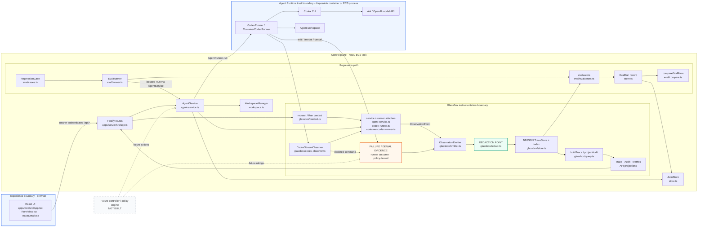

# Architecture

Volc Agent Launchpad is a single-node control plane. GlassBox observes the existing execution path; it does not replace the runner or become a second source of Run state.

## Implemented system

[PNG export of the architecture diagram](assets/architecture.png)

The browser, control plane, and Agent Runtime are separate trust boundaries. The API token protects the demo endpoint but is not user identity or authorization. The runtime boundary limits ordinary execution; it is not hardened multi-tenant isolation. Secrets and content cross into telemetry only through `redactEvent`, before the NDJSON append. Failures and sandbox denials remain observations: they do not grant GlassBox control over execution.

## Contract

`apps/server/src/glassbox/schema.ts` is the authoritative event contract. Every `ObservationEvent` carries bounded correlation identifiers (`traceId`, `spanId`, `runId`, `agentId`), actor and source attribution, sequence and timing, category/type/status, bounded attributes, optional safe summary/error, and privacy metadata. `schemaVersion` is `1.0`; additive event types do not invalidate stored 1.0 events.

The behavioral rules are maintained in [GlassBox invariants](../.claude/rules/glassbox-invariants.md). In particular, telemetry must never break baseline Agent behavior, fabricate evidence, leak credentials, or confuse absence with unavailability.

## Persisted and derived data

| Persisted | Derived at read time |
| --- | --- |
| Agent, message, Run, regression case and EvalRun records in `data/launchpad.json` (`JsonStore`) | Span trees, durations, first actionable failure and capability state (`buildTrace`) |
| Redacted, bounded `ObservationEvent` lines in `data/traces/<runId>.ndjson` | Trace, Audit and Metrics projections |
| Bounded trace index entries in `data/traces/index.json` | Workspace change totals, token/tool metrics and comparison presentation |
| Agent workspaces below `workspaces/` and archived deletions below `workspaces/.deleted/` | Eval verdicts produced by deterministic evaluators from stored Run evidence |
| Codex configuration and resumable sessions below `codex-home/` | UI filters, attention counts and dashboard summaries |

`JsonStore` serializes writes and atomically replaces one JSON file. `TraceStore` appends one redacted NDJSON stream per Run and maintains a bounded index. Both are single-process POC stores.

## Execution profiles

| Profile | Control plane | Agent execution |
| --- | --- | --- |
| Local POC | Host Node.js | Disposable Docker, Colima, or Podman container per turn |
| ECS | Application container | Codex child process in the same task |
| Local development | Host Node.js | Host Codex process |

Both runner adapters use argv-only process execution, bounded output/time, resumable Codex threads, and escalating termination. The same `AgentService` Run path is used by interactive and isolated regression execution.

## Intentionally not built

- No autonomous controller, approval engine, or policy-enforcement loop; the dashed controller boundary is an extension seam only.
- No multi-user identity, authorization, hardened tenant isolation, or distributed control plane.
- No external trace database or message bus; JSON and NDJSON are deliberate POC storage choices.
- No LLM-based evaluator or success inference. Regression evaluators use explicit stored evidence.
- No deployment topology beyond the local POC and single ECS task described above.
