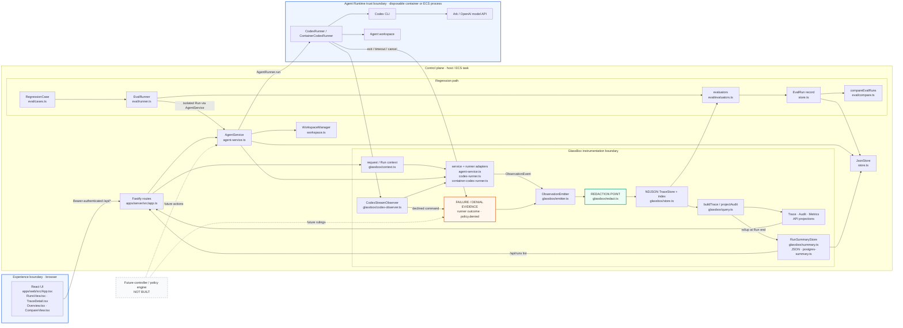

# Architecture

Volc Agent Launchpad is a single-node control plane. GlassBox observes the existing execution path; it does not replace the runner or become a second source of Run state.

## The one-page diagram

Reading guide: dashed borders are trust boundaries (untrusted browser client, untrusted runtime execution); ★ marks the five instrumentation points where adapters sit on existing seams; the green gate is the single redaction boundary every event crosses before it can exist on disk, API, export or log (and the serve gate scrubs the raw conversation store on every read); ↻ marks recovery behavior (non-blocking emitter, `telemetry.degraded`, fail-closed redaction, honest restart cancellation); the purple loop is verification replaying saved evidence through the same real execution path until `PASS→FAIL = REGRESSION`.

## Implemented system (component detail)

[PNG export of the architecture diagram](assets/architecture.png)

The browser, control plane, and Agent Runtime are separate trust boundaries. The API token protects the demo endpoint but is not user identity or authorization. The runtime boundary limits ordinary execution; it is not hardened multi-tenant isolation. Secrets and content cross into telemetry only through `redactEvent`, before the NDJSON append. Failures and sandbox denials remain observations: they do not grant GlassBox control over execution.

## Contract

`apps/server/src/glassbox/schema.ts` is the authoritative event contract. Every `ObservationEvent` carries bounded correlation identifiers (`traceId`, `spanId`, `runId`, `agentId`), actor and source attribution, sequence and timing, category/type/status, bounded attributes, optional safe summary/error, and privacy metadata. `schemaVersion` is `1.0`; additive event types do not invalidate stored 1.0 events.

The behavioral rules are maintained in [GlassBox invariants](../.claude/rules/glassbox-invariants.md). In particular, telemetry must never break baseline Agent behavior, fabricate evidence, leak credentials, or confuse absence with unavailability.

## Persisted and derived data

| Persisted | Derived at read time |
| --- | --- |
| Agent, message, Run (with `configHash`), regression case (`baselineConfigHash`, `templateHash`) and EvalRun records (per-case evaluator results, `templateHashes`) in `data/launchpad.json` (`JsonStore`) | Span trees, durations, first actionable failure and capability state (`buildTrace`, a pure function of the events) |
| Redacted, bounded `ObservationEvent` lines in `data/traces/<runId>.ndjson` (`NdjsonTraceStore`), or the `observation_events` PostgreSQL table when `GLASSBOX_STORE=postgres` (`PostgresTraceStore`, `apps/server/sql/002_observation_events.sql`) | Trace, Audit and Metrics projections |
| Per-Run summaries (`RunSummaryStore`): `runSummaries` inside `launchpad.json`, or the `runs_summary` PostgreSQL table when `GLASSBOX_STORE=postgres` (`apps/server/sql/001_runs_summary.sql`); rolled up from the trace at Run end | Trace index: rebuilt in memory from the trace backend at boot, never persisted itself |
| Agent workspaces below `workspaces/` and archived deletions below `workspaces/.deleted/` | Workspace change totals and token/tool metrics (from `workspace.changed` and model/tool events) |
| Codex configuration and resumable sessions below `codex-home/` | EvalRun comparison (`compareEvalRuns`, including the template-hash mismatch flag), UI filters, attention counts and dashboard summaries |

`JsonStore` serializes writes and atomically replaces one JSON file. `TraceStore` appends one redacted NDJSON stream per Run and keeps a bounded in-memory index. `RunSummaryStore` is the read model for Run lists and aggregation so those never re-read NDJSON; its JSON backend is the judged default and the PostgreSQL backend (`docker compose --profile postgres`) is opt-in. Traces stay NDJSON either way. All are single-process POC stores.

## Execution profiles

| Profile | Control plane | Agent execution |
| --- | --- | --- |
| Local POC | Host Node.js | Disposable Docker, Colima, or Podman container per turn |
| ECS | Application container | Codex child process in the same task |
| Local development | Host Node.js | Host Codex process |

Both runner adapters use argv-only process execution, bounded output/time, resumable Codex threads, and escalating termination. The same `AgentService` Run path is used by interactive and isolated regression execution.

## Intentionally not built

- No autonomous controller, approval engine, or policy-enforcement loop; the dashed controller boundary is an extension seam only.
- No multi-user identity, authorization, hardened tenant isolation, or distributed control plane.
- No external trace database or message bus; NDJSON is the deliberate POC trace store. PostgreSQL is an opt-in backend for Run summaries only.
- No LLM-based evaluator or success inference. Regression evaluators use explicit stored evidence. The `postCheck` assertion type is defined but `EvalRunner` runs evaluators without a workspace runner, so it reports "unavailable" rather than executing commands.
- No deployment topology beyond the local POC and single ECS task described above.
